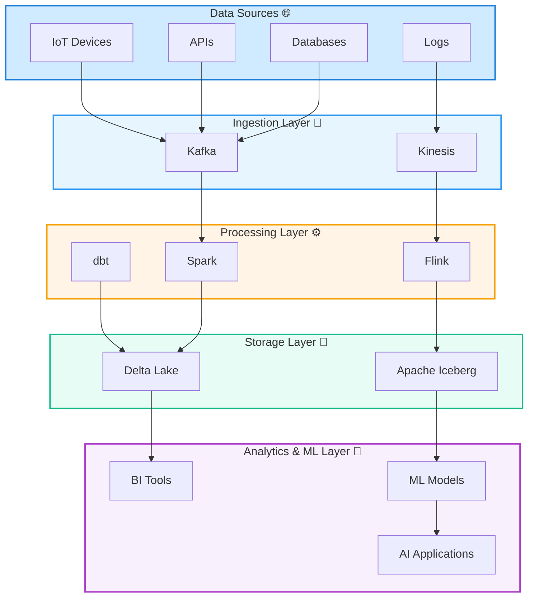
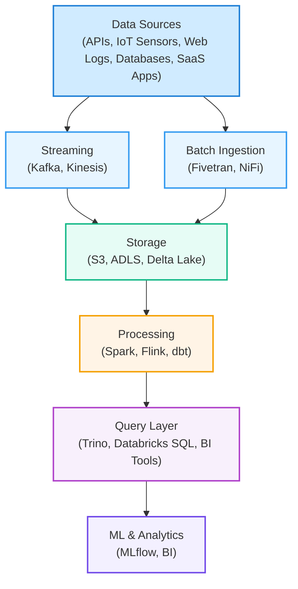

---
tags:
  - bigdata
---
**Big Data** refers to datasets that are so **large, diverse, and fast-changing** that traditional systems for storage and processing can't handle them efficiently.

📊 **The key characteristics of Big Data — "5V":**

1. **Volume** — huge amounts of data: terabytes, petabytes, even exabytes.
    
2. **Velocity** — data is generated and must be processed in (near) real time, such as IoT streams or system logs.
    
3. **Variety** — structured, semi-structured, and unstructured data (tables, JSON, videos, sensor readings, text, etc.).
    
4. **Veracity** — the quality and reliability of data vary, requiring careful handling of noise, errors, and duplicates.
    
5. **Value** — the ultimate goal is not just to collect data, but to **extract business value** from it: insights, predictions, and automation.

💡 **NOTE:**

However, the definition above is not necessarily complete.

Nick Dimiduk and Amandeep Khurana, authors of _HBase in Action_, argue that Big Data represents a fundamentally different way of thinking about data and how it can be used to drive business value.

Big Data is not just about “a lot of data.” It is an **ecosystem of technologies** (such as Spark, Hadoop, Kafka, Delta Lake, etc.), **methods** (including ETL, stream processing, and machine learning), and **architectural approaches** that transform chaotic streams of information into actionable insights.

### The 5V Characteristics of Big Data

1. **Volume**

	Big Data refers to massive amounts of information generated every second — from terabytes to petabytes.  
    
    💡 _Examples:_
    
    - Application logs produced by millions of mobile users.
        
    - IoT sensor data from autonomous vehicles or smart devices. These datasets are stored in **distributed storage systems** like **HDFS**, **Amazon S3**, or **Azure Data Lake Storage**, often managed through **Delta Lake** or **Apache Iceberg** for reliability and schema evolution.

2. **Variety**  

	Big Data comes in different forms: **structured** (SQL tables), **semi-structured** (JSON, XML, Avro), and **unstructured** (images, videos, text, logs).  
    
    💡 _Examples:_
    
    - An e-commerce platform combines transaction data (SQL), clickstream events (JSON), and user reviews (text). Frameworks like **Apache Spark** or **Databricks** allow processing across multiple data formats (Parquet, ORC, Delta).
        
3. **Velocity**  
    
    Refers to the speed at which data is generated, processed, and analyzed. Many systems require **real-time or near real-time** processing.  
    
    💡 _Examples:_
    
    - Fraud detection systems analyze thousands of financial transactions per second. Tools like **Apache Kafka**, **Flink**, and **Spark Structured Streaming** enable **stream processing** pipelines that react instantly to new data.
        
4. **Veracity**  
    
    Data quality and reliability are critical — especially when dealing with noisy, incomplete, or inconsistent sources.  
    
    💡 _Examples:_
    
    - Social media analytics must filter misinformation and duplicate content. Solutions include **data validation frameworks** like **Great Expectations** or **AWS Deequ**, and cleansing via **ETL/ELT** pipelines.

3. **Value**  
    
    The ultimate goal of Big Data is to extract **business value** through insights, predictions, and optimization.  
    
    💡 _Examples:_
    
    - Real-time price optimization at platforms like Uber or Booking.com. This is achieved through **data science**, **machine learning**, and **predictive analytics** applied on large-scale datasets.

### Business Applications of Big Data

- **E-commerce & Marketing Personalization:** recommendation systems (e.g. Amazon’s collaborative filtering).
    
- **Finance:** real-time fraud detection and risk modeling.
    
- **Manufacturing:** predictive maintenance using IoT sensor data.
    
- **Healthcare:** AI-powered medical image analysis and real-time patient monitoring.
    
- **Transport & Logistics:** route optimization based on live GPS and weather data (e.g. UPS, Tesla).
    
- **Energy:** demand forecasting and smart grid optimization.

Each of these applications leverages distributed data processing and machine learning models to convert raw data into actionable insights.

### Approaches to store data

| Aspect              | Traditional                             | Modern                                          |
| ------------------- | --------------------------------------- | ----------------------------------------------- |
| **Data structure**  | Structured (SQL, relational)            | Structured, unstructured, semi-structured       |
| **Storage**         | Centralized database (Oracle, Teradata) | Distributed file systems (HDFS, S3, Delta Lake) |
| **Scalability**     | Vertical (bigger servers)               | Horizontal (more nodes)                         |
| **Processing**      | Batch only                              | Batch and Streaming                             |
| **Cost model**      | High, on-premises                       | Cloud-based, pay-as-you-go                      |
| **Schema handling** | Schema-on-write                         | Schema-on-write, Schema-on-read                 |
| **Tooling**         | ETL, SQL, BI tools                      | Spark, Kafka, dbt, Delta Live Tables, ETL/ELT   |
| Examples            | Data Warehouses, relational databases   | Data Warehouses, data lakes, lakehouses         |

Modern architectures converge into the **Lakehouse paradigm**, combining the flexibility of a **Data Lake** with the transactional reliability of a **Data Warehouse** — enabling both advanced analytics and AI workloads on the same data.

### 🔄 Typical Big Data Flow

This end-to-end flow illustrates how modern data systems handle ingestion, transformation, and analysis at scale — providing a foundation for **data-driven decision making**.

### ⚙️ Big Data Ecosystem — Core Technologies and Their Roles

Big Data solutions rely on a diverse ecosystem of tools designed to handle each stage of the data lifecycle — from **ingestion** to **storage**, **processing**, and **analytics**.  
Below is a breakdown of the most widely used technologies and how they interact in a real-world data architecture.

#### 🟢 Data Ingestion Layer

Responsible for **collecting and streaming** data from various sources into the processing layer.

|Tool|Description|Typical Use|
|---|---|---|
|**Apache Kafka**|Distributed streaming platform that handles real-time data pipelines.|Event-driven architectures, log streaming, real-time analytics.|
|**Amazon Kinesis**|AWS-managed alternative to Kafka.|Real-time ingestion for AWS-based pipelines.|
|**Apache NiFi**|Visual data flow automation tool.|Moving and transforming data between heterogeneous systems.|
|**Fivetran / Airbyte**|ELT connectors for SaaS applications and databases.|Simplified data integration in modern data stacks.|

💡 _Example:_ Kafka collects clickstream events from a web app, and streams them into a Spark Structured Streaming job for processing.

### 🟡 Data Storage Layer

Responsible for **persisting massive datasets** reliably and cheaply, with support for different data formats and access patterns.

| Tool                                          | Description                                        | Typical Use                                             |
| --------------------------------------------- | -------------------------------------------------- | ------------------------------------------------------- |
| **HDFS (Hadoop Distributed File System)**     | Foundational distributed filesystem.               | On-premise storage for Hadoop clusters.                 |
| **Amazon S3 / Azure Data Lake Storage / GCS** | Cloud object storage.                              | Scalable, cost-effective data lakes.                    |
| **Delta Lake**                                | Transactional storage layer over cloud data lakes. | ACID transactions, schema enforcement, time travel.     |
| **Apache Iceberg / Apache Hudi**              | Table formats designed for large-scale analytics.  | Data versioning, schema evolution, incremental updates. |

💡 _Example:_ Raw JSON logs are stored in S3, curated into Delta tables, and queried efficiently with SQL engines like Databricks or Trino.

### 🔵 Data Processing Layer

The computational backbone of Big Data — responsible for transforming, cleaning, aggregating, and analyzing data.

|Tool|Description|Typical Use|
|---|---|---|
|**Apache Spark**|Unified analytics engine for batch and stream processing.|ETL, machine learning, interactive analytics.|
|**Apache Flink**|Stream processing framework with low-latency stateful computations.|Real-time analytics, fraud detection, event processing.|
|**Apache Beam**|Unified programming model for batch + stream pipelines.|Cross-platform data pipelines (runs on Flink, Spark, Dataflow).|
|**dbt (Data Build Tool)**|SQL-based transformation framework.|Data modeling and transformation in the ELT paradigm.|

💡 _Example:_ Spark jobs convert semi-structured IoT data into Parquet format and write it to a Delta Lake table with optimized storage.

### 🟣 Data Query and Access Layer

Provides tools for **interactive querying**, **ad-hoc analysis**, and **data exploration** across large datasets.

|Tool|Description|Typical Use|
|---|---|---|
|**Presto / Trino**|Distributed SQL engine for querying data lakes.|Interactive SQL queries across heterogeneous sources.|
|**Hive / Impala**|SQL-on-Hadoop engines.|Legacy batch queries, data warehouse workloads.|
|**Databricks SQL / Snowflake / BigQuery**|Cloud-native analytical engines.|High-performance analytics and BI dashboards.|

💡 _Example:_ Analysts use Trino to query Delta Lake tables stored in S3, joining them with customer data from Postgres in seconds.

### 🟠 Machine Learning & Analytics Layer

Bridges data engineering with AI — enabling predictive modeling and data-driven automation.

|Tool|Description|Typical Use|
|---|---|---|
|**MLflow**|Open-source platform for ML lifecycle management.|Experiment tracking, model registry, deployment.|
|**TensorFlow / PyTorch / scikit-learn**|Machine learning and deep learning frameworks.|Model training and inference on large datasets.|
|**Databricks AutoML / SageMaker**|Managed ML services in the cloud.|Simplified training, hyperparameter tuning, and deployment.|
|**Power BI / Tableau / Looker**|Business Intelligence visualization tools.|Dashboards, metrics, and decision-making support.|

💡 _Example:_ Trained MLflow models predict customer churn directly on Delta tables, visualized through Power BI.

### 🧩 Putting It All Together — Example Architecture

This ecosystem enables **scalable**, **real-time**, and **cost-efficient** analytics — forming the backbone of modern **data platforms and lakehouse architectures**.
