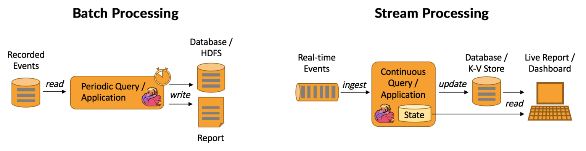
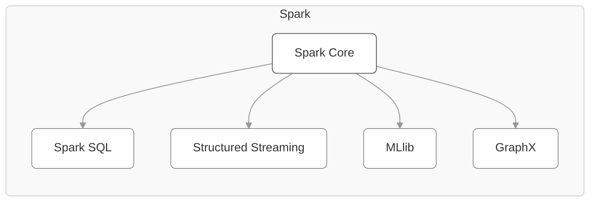
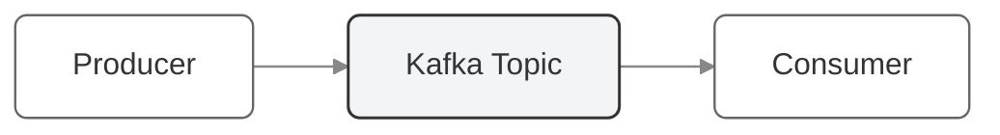
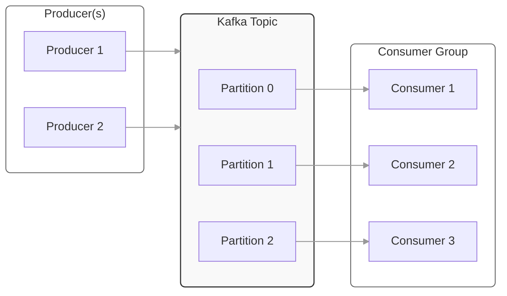
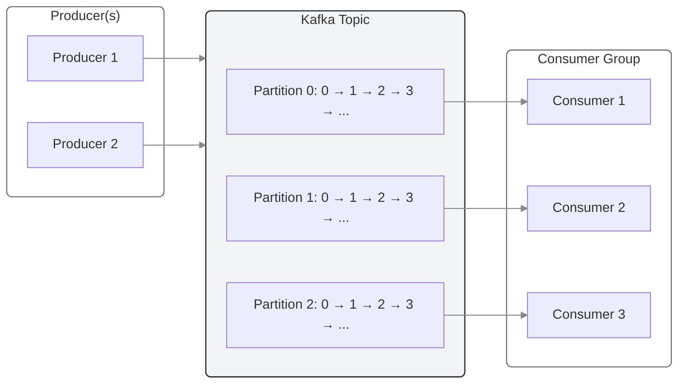

---
tags:
  - bigdata
---
Modern data systems must handle both **historical data analysis** and **real-time event processing**. These two paradigms — **batch** and **stream processing** — differ in architecture, latency, and typical use cases, but often coexist within the same platform.



### 🧱 Batch Processing

**Definition:**

Batch processing involves collecting large volumes of data over a period of time and processing it in discrete, scheduled runs (e.g., hourly, nightly).

**Characteristics:**

- High throughput, but higher latency.
    
- Suitable for historical or aggregated analysis.
    
- Data is complete and stable at the time of processing.
    
- Usually triggered by orchestration tools (e.g., Apache Airflow, Dagster).
    
**Typical Use Cases:**

- Daily business reports and dashboards.
    
- Monthly billing and invoicing.
    
- Data warehouse transformations (dbt, Spark SQL).
    
- Machine learning feature generation from historical data.

**Advantages:**

- Simpler fault tolerance and consistency.
    
- Optimized for complex, large-scale aggregations.
    
- Easier to maintain and debug.
    
💡 _Example:_

A nightly Spark job processes 2 TB of clickstream logs stored in S3 and aggregates them into daily marketing performance metrics.

### 🌊 Stream Processing

**Definition:**  

Stream processing handles continuous data flows — events are processed as soon as they arrive, enabling **real-time analytics** and immediate responses.

**Characteristics:**

- Low latency (milliseconds to seconds).
    
- Data is processed record by record or in micro-batches.
    
- Requires stateful processing and checkpointing.
    
- Uses message brokers like Kafka or Kinesis.
    
**Typical Use Cases:**

- Fraud detection in financial transactions.
    
- Monitoring IoT sensors or website activity in real time.
    
- Real-time personalization and recommendations.
    
- Log analytics and alerting systems.

**Advantages:**

- Real-time decision-making and alerts.
    
- Reduced time-to-insight (no waiting for batch windows).
    
- Scalable event-driven architectures.

💡 _Example:_

Kafka streams incoming payment events; Flink detects anomalies and flags suspicious transactions in under one second.

### ⚖️ Comparison of Batch and Stream Processing


|Aspect|**Batch Processing**|**Stream Processing**|
|---|---|---|
|**Data type**|Historical, static data|Continuous, real-time events|
|**Latency**|Minutes to hours|Milliseconds to seconds|
|**Processing model**|Periodic jobs|Continuous event flow|
|**Complexity**|Easier to implement|Harder — requires state management|
|**Fault tolerance**|Retries on failure|Checkpoints and event replay|
|**Typical tools**|Spark, dbt, Hive, Airflow|Kafka, Flink, Spark Streaming|
|**Use cases**|Reporting, ETL, ML training|Monitoring, alerts, fraud detection|

Modern architectures often combine both: batch for history and stream for freshness — the foundation of **Lambda** and **Kappa** architectures.

### 🚀 Key Technologies

Let’s break down the main frameworks powering batch and stream workloads.

#### 🧩 Apache Spark

A **unified analytics engine** for large-scale data processing — supports both **batch** and **streaming** workloads.



**Core features:**

- In-memory distributed computing for massive datasets.
    
- APIs in Python (PySpark), Scala, Java, and SQL.
    
- Modules:
    
    - **Spark SQL** – declarative data transformations.
        
    - **Spark Structured Streaming** – stream processing using micro-batches.
        
    - **MLlib** – distributed machine learning.
        
    - **GraphX** – graph analytics.

💡 _Example:_

```python
# PySpark Structured Streaming example
stream_df = (spark.readStream
                  .format("kafka")
                  .option("subscribe", "events")
                  .load())

parsed = stream_df.selectExpr("CAST(value AS STRING)")
parsed.writeStream.format("delta").outputMode("append").start("/delta/events")
```

💡 Spark Structured Streaming uses the same API as batch Spark — allowing seamless transition between historical and real-time processing.

#### 🔁 Apache Kafka

A **distributed event streaming platform** that acts as the backbone of many real-time systems.

**Core concepts:**

- **Producer → Topic → Consumer** model.



- **Partitions** for parallelism and scalability.



- **Offsets** for message ordering and replay.
    


- **Kafka Connect** and **Kafka Streams** for integration and stream transformation.

**Example Use Cases:**

- Log aggregation and centralized event bus.
    
- Streaming ETL: ingest raw events → enrich → write to Delta Lake.
    
- Backpressure handling for fluctuating workloads.

💡 Kafka is not for computation itself — it’s the **data transport layer** that feeds stream processors like Flink or Spark.

#### ⚙️ Apache Flink

A **true stream-first** processing engine, built for real-time data processing that ensures low-latency, stateful event handling with exactly-once semantics, enabling reliable and consistent computations over continuously arriving data.


**Core features:**

- Native streaming model (not micro-batch).
    
- Exactly-once state consistency.
    
- Time semantics (event time, processing time, watermarks).
    
- Stateful operations (windows, joins, aggregations).
    
- Integration with Kafka, S3, Cassandra, and Delta Lake.

**Example Use Cases:**

- Fraud detection.
    
- Real-time analytics dashboards.
    
- Continuous ETL pipelines.
    
💡 Flink shines when latency <1s matters — it’s ideal for continuous pipelines that never stop.

#### 💽 Delta Lake

**Delta Lake** is an open-source storage layer (by Databricks) that brings **ACID transactions**, **schema evolution**, and **stream–batch unification** to data lakes.


**Key advantages:**

- Guarantees data consistency even under concurrent writes.

- Supports _time travel_ (querying historical data versions).

- Optimized for both batch and streaming.
    
- Compatible with Spark, Flink, and Kafka.

💡 _Example:_

Using Delta Lake, you can continuously write streaming data from Kafka and run SQL queries on it instantly:

```python
from delta.tables import DeltaTable

# Stream from Kafka into a Delta table
stream = (spark.readStream
                .format("kafka")
                .option("subscribe", "events")
                .load())

(stream.writeStream
      .format("delta")
      .option("checkpointLocation", "/checkpoints/events")
      .start("/delta/events"))
```

💡 Delta’s **unified batch/stream processing** concept simplifies Lambda architectures — enabling a single table to support both historical and real-time data analysis.

#### 🌐 Summary

|Technology|Type|Role in Pipeline|Typical Use|
|---|---|---|---|
|**Apache Spark**|Batch + Stream|Computation engine for large-scale transformations.|ETL, analytics, ML.|
|**Apache Kafka**|Stream|Message broker for real-time data movement.|Event transport, streaming ingestion.|
|**Apache Flink**|Stream|Low-latency, stateful processing.|Real-time analytics, monitoring.|
|**Delta Lake**|Storage Layer|ACID-compliant data lake supporting both batch and stream writes.|Unified Lakehouse foundation.|

### 🧠 Takeaway

- **Batch processing** powers deep historical insight; **streaming** enables instant reaction.
    
- **Spark** bridges the two worlds, **Kafka** moves data, **Flink** reacts in milliseconds, and **Delta Lake** ensures data reliability.
    
- Together, they form the **core engine room of modern data architectures** — flexible, scalable, and real-time.
