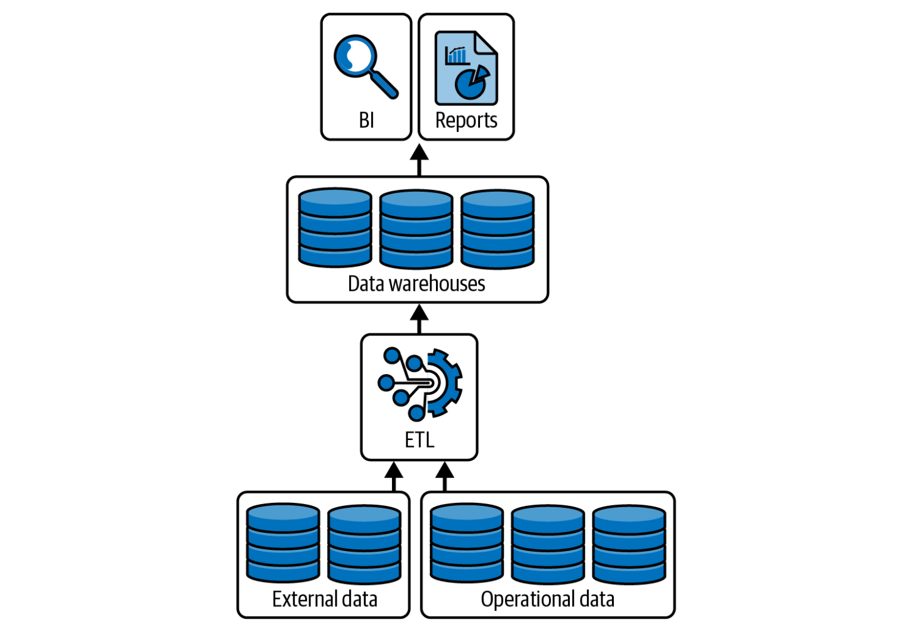
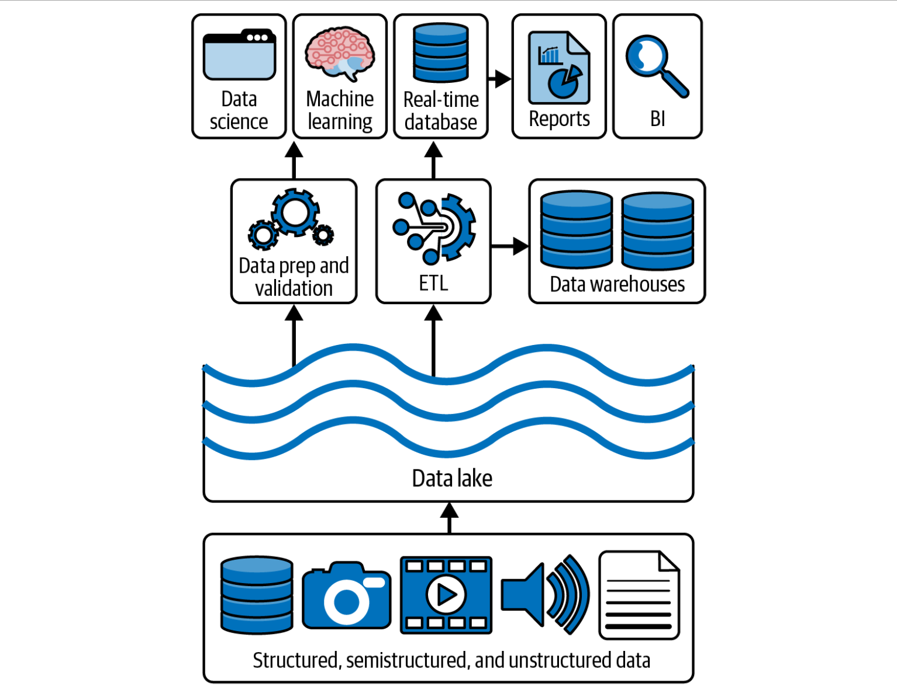
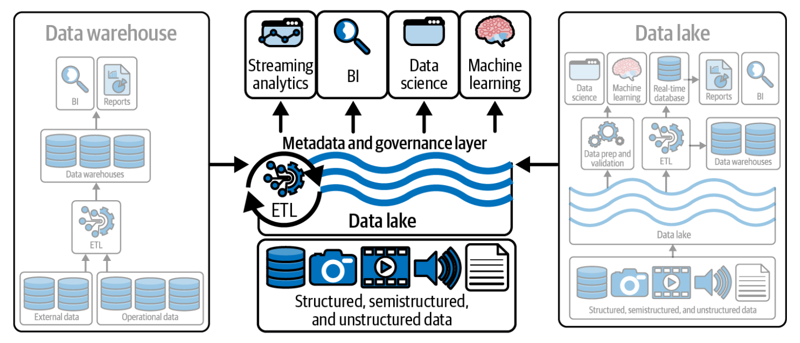
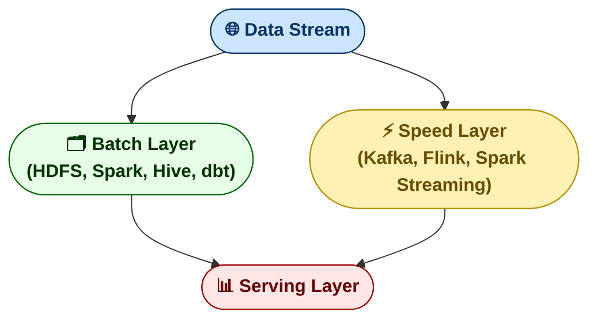
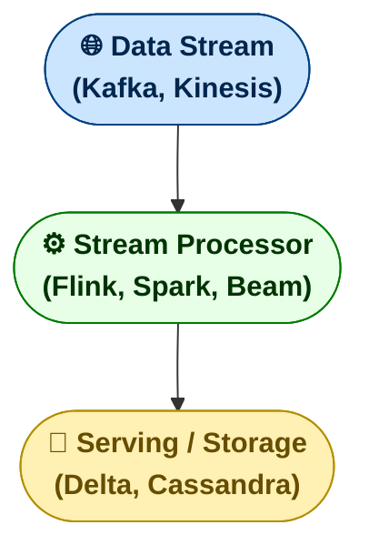
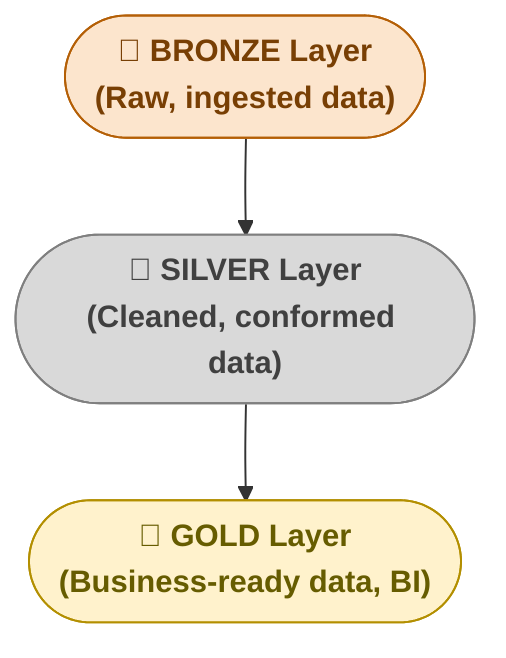

---
tags:
  - bigdata
---
Modern data architectures have evolved from simple ETL pipelines into sophisticated, multi-layered platforms that support **batch**, **streaming**, and **machine learning** workloads simultaneously.  
This section outlines the main paradigms and architectural models used in contemporary data systems.

### ⚙️ ETL vs ELT

#### 🧩 **1. Extract**

**Goal:** collect data from multiple heterogeneous sources — APIs, databases, files, logs, sensors, etc.

**How it works:**

- Connectors or agents pull data from various systems (e.g., PostgreSQL, Salesforce, S3).
    
- Data is extracted in its _raw_ form, without transformations.
    
- Often performed incrementally (only new or changed records are fetched).

**Typical tools:**

- **Fivetran**, **Airbyte**, **Apache NiFi**, **AWS Glue**, **Kafka Connect**
    
- SQL queries, REST APIs, CDC (Change Data Capture)

💡 _Examples:_

```sql
SELECT * FROM sales WHERE updated_at > last_sync_time;
```

→ This pulls the latest records from `sales` into a staging layer.

#### ⚙️ **2. Load**

**Goal:** store the extracted data in a target system — usually a **Data Lake**, **Data Warehouse**, or **staging area**.

**How it works:**

- Data is loaded into the raw or staging zone without modifications.
    
- Common formats: **Parquet**, **ORC**, **Avro**, **JSON**.
    
- In streaming pipelines (e.g., Kafka → Delta Lake), loading happens continuously.

**Typical tools:**

- **Amazon S3**, **Azure Data Lake Storage**, **Google BigQuery**, **Snowflake**, **Delta Lake**
    
- **dbt**, **Airflow**, **Databricks Autoloader**
    
💡 _Examples:_
```
Raw data → s3://data-lake/raw/sales/2025-10-06/
```

#### 🔄 **3. Transform**

**Goal:** clean, normalize, aggregate, and prepare data for analytics or machine learning.

**How it works:**

- Deduplication, type casting, filling nulls, standardizing formats.
    
- Building business models such as facts, dimensions, and data marts.
    
- Executed via SQL transformations or distributed compute engines like Spark/Flink.

**Typical tools:**

- **dbt**, **Apache Spark**, **Databricks**, **Flink**, **Snowpark**, **SQL**
    
💡 _Examples:_

```sql
CREATE TABLE IF NOT EXISTS clean.sales AS
SELECT customer_id,
       SUM(amount) AS total_sales,
       DATE_TRUNC('month', sale_date) AS month
FROM raw.sales
GROUP BY customer_id, month;
```

### 🧠 Modern evolution

The newer paradigm **ELT** (Extract → Load → Transform) reverses the last two steps. Data is first loaded _as-is_ into the warehouse or data lake and then transformed _in-place_ using its computational power (e.g., in **Snowflake**, **BigQuery**, or **Databricks**).

This approach improves scalability and reduces load on source systems.

|Aspect|**ETL (Extract → Transform → Load)**|**ELT (Extract → Load → Transform)**|
|---|---|---|
|**Process flow**|Data is extracted, transformed on an external engine, and then loaded into the data warehouse.|Raw data is first loaded into a data lake or warehouse, then transformed _in place_.|
|**Best for**|Traditional data warehouses with limited compute resources.|Modern cloud-based architectures (Snowflake, Databricks, BigQuery).|
|**Tools**|Informatica, Talend, SSIS.|dbt, Spark SQL, Databricks workflows.|
|**Advantages**|Early data validation, strict schema enforcement.|Scales better, cheaper storage, supports semi/unstructured data.|
|**Drawbacks**|Difficult to scale, limited flexibility.|May require stronger data governance to control raw data chaos.|

💡 _Example:_

In a **dbt + Snowflake** pipeline, you use **ELT**: raw data lands in a staging schema (raw tables), and dbt transforms it into clean analytical models inside the warehouse.

### 🏢 Data Warehouse vs Data Lake vs Lakehouse

#### Data Warehouse

A **Data Warehouse** is a centralized system designed to store and manage **structured, historical data** from multiple sources for **analytics and reporting**.

It integrates data through ETL or ELT processes, organizes it into **subject-oriented schemas** (like _sales_, _customers_, _finance_), and allows fast querying using SQL.

💡 Typically, a data warehouse supports **Business Intelligence (BI)**, dashboards, and analytical workloads rather than operational transactions.

💡 _Examples:_

- **Snowflake**, **Amazon Redshift**, **Google BigQuery**, **Azure Synapse Analytics**.



#### Data Lake

A **Data Lake** is a centralized repository that stores **raw, unstructured, semi-structured, and structured data** at any scale.

Unlike a data warehouse, it doesn’t require predefined schemas — data is stored _as-is_ (“schema-on-read”) and transformed only when needed for analysis. This flexibility makes it ideal for **big data analytics, machine learning, and data exploration**.

💡 Data Lakes typically use low-cost, scalable object storage such as **Amazon S3**, **Azure Data Lake Storage (ADLS)**, or **Google Cloud Storage**.

**Examples of technologies:**

- **Delta Lake**, **Apache Iceberg**, **Apache Hudi** — these add ACID transactions, versioning, and schema management to modern data lakes.



#### Lakehouse

A **Data Lakehouse** is a modern data architecture that **combines the flexibility of a Data Lake with the management and performance features of a Data Warehouse**.

It allows you to store all types of data — structured, semi-structured, and unstructured — in a single repository, while still supporting **ACID transactions, governance, schema enforcement, and fast SQL queries**.

💡 The Lakehouse eliminates the traditional split between _“data for analysts”_ (in warehouses) and _“data for data scientists”_ (in lakes), enabling both analytics and AI workloads on the same data.

**Typical technologies:**

- **Databricks Delta Lake**, **Apache Iceberg**, **Apache Hudi**, **Snowflake Arctic**

 

#### Comparison

| Feature        | **Data Warehouse**                 | **Data Lake**                                          | **Lakehouse**                                     |
| -------------- | ---------------------------------- | ------------------------------------------------------ | ------------------------------------------------- |
| **Data type**  | Structured (SQL tables).           | All types (structured, semi-structured, unstructured). | Unified — handles all formats.                    |
| **Schema**     | Schema-on-write (defined upfront). | Schema-on-read (flexible).                             | Hybrid: schema enforcement + flexibility.         |
| **Storage**    | Proprietary, high-performance.     | Cheap object storage (S3, ADLS, GCS).                  | Object storage with ACID transactions.            |
| **Processing** | Batch SQL queries.                 | Batch + Streaming.                                     | Batch + Streaming + ML.                           |
| **Use cases**  | Business intelligence, reporting.  | Data exploration, ML training.                         | Unified analytics and machine learning.           |
| **Examples**   | Snowflake, Redshift, BigQuery.     | Hadoop, S3, ADLS.                                      | Databricks Lakehouse, Delta Lake, Apache Iceberg. |

💡 _In practice:_

Modern companies integrate the three — collecting raw data in a **lake**, curating and modeling it into **warehouse-style** tables, and running analytics and ML on top of a **lakehouse** architecture.

### ⚡ Lambda vs Kappa Architectures

These are two models for handling **real-time and batch data processing**.

#### Lambda Architecture

Combines **batch processing** for accuracy and **stream processing** for real-time results.



- **Pros:** Accurate + near real-time data; fault tolerance.
    
- **Cons:** Duplicate logic in batch and speed layers (hard to maintain).
    
- **Used by:** Legacy systems (Netflix, LinkedIn early architectures).
    
#### Kappa Architecture

Simplifies the Lambda model by removing the batch layer.  
All processing — real-time and historical — is done through the **streaming pipeline**.



- **Pros:** Simpler, consistent logic, true real-time architecture.
    
- **Cons:** Complex reprocessing of historical data if schema changes.
    
- **Used by:** Modern streaming-first companies (Uber, Twitter, Confluent).

💡 _In short:_

- **Lambda = batch + streaming.**
    
- **Kappa = streaming-only, reprocesses all events.**

### 🧩 Components of a Modern Data System

A modern data platform is built from modular components that handle each stage of the data lifecycle:

|Layer|Main Responsibility|Common Tools|
|---|---|---|
|**Data Ingestion**|Collect and move data from sources.|Kafka, Kinesis, Airbyte, Fivetran.|
|**Storage**|Persist raw and curated data.|S3, ADLS, Delta Lake, Iceberg.|
|**Processing**|Transform, clean, aggregate.|Spark, Flink, dbt, Beam.|
|**Metadata & Governance**|Manage schema, lineage, catalog.|Hive Metastore, Unity Catalog, Amundsen, DataHub.|
|**Orchestration**|Coordinate and schedule pipelines.|Airflow, Dagster, Prefect.|
|**Serving & Analytics**|Query, visualize, and build ML models.|Trino, Databricks SQL, Power BI, MLflow.|

This modularity allows teams to evolve their platforms incrementally — swapping tools without rewriting the entire stack.

### 🥇 Medallion Architecture (Bronze–Silver–Gold)

The **Medallion Architecture** (developed by Databricks) organizes data into logical layers that improve **data quality**, **traceability**, and **governance**.



|Layer|Purpose|Example|
|---|---|---|
|**Bronze**|Raw ingestion from sources (no transformations).|Kafka → Delta Lake raw tables.|
|**Silver**|Data cleaned, deduplicated, joined with reference data.|Remove nulls, enrich user IDs with profile data.|
|**Gold**|Aggregated and business-ready datasets.|KPI dashboards, machine learning features.|


💡 _Typical flow:_

Raw IoT telemetry → **Bronze** (raw JSON) → **Silver** (cleaned sensor readings) → **Gold** (aggregated device performance metrics).

### 🌐 Summary

- **ETL** transforms before loading — best for legacy systems; **ELT** transforms inside the target system — ideal for cloud.
    
- **Data Warehouse → Data Lake → Lakehouse** represents the natural evolution of analytical architectures.
    
- **Lambda vs. Kappa:** hybrid vs. unified streaming.
    
- **Modern data platforms** are modular, cloud-native, and automation-driven.
    
- **Medallion architecture** standardizes data curation and quality.
