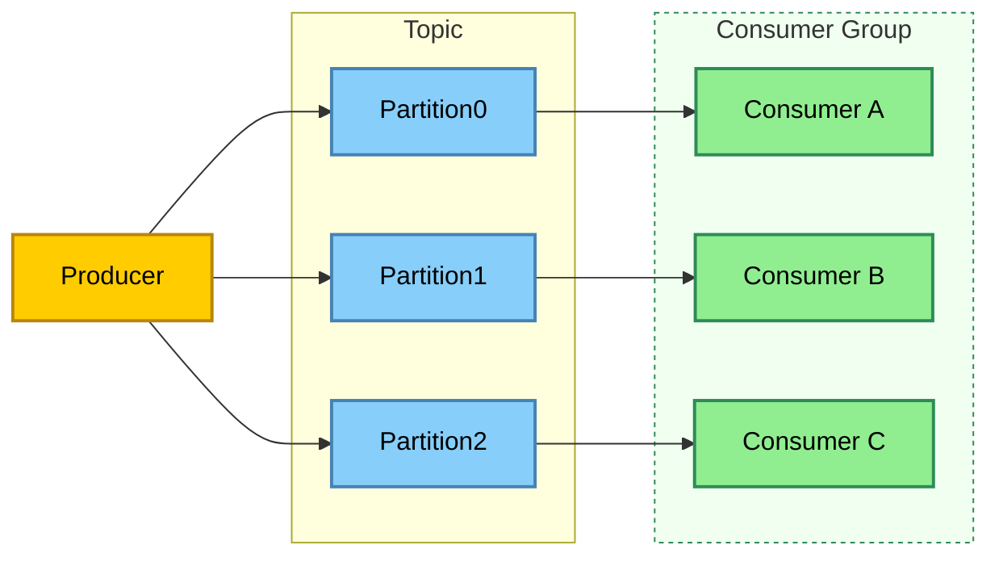
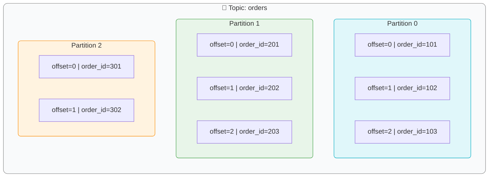

---
tags:
  - bigdata
  - workshop
  - kafka
---
### Introduction to Stream Data Transmission

Apache Kafka is a **distributed streaming platform** designed for **real-time data ingestion, storage, and processing**. It acts as a **high-throughput message broker**, enabling systems to exchange data in the form of continuous streams rather than periodic batches.

Kafka’s architecture is based on a **publish–subscribe model**:

- **Producers** send messages (events) to **topics**.
    
- **Brokers** store these messages durably.
    
- **Consumers** subscribe to topics and read messages in real-time.



Each topic is divided into **partitions**, which allows horizontal scaling and parallel processing.  
Messages within a partition are ordered and assigned an **offset** — a unique sequential ID that enables consumers to track their reading position.



**Example use cases:**

- Log aggregation from microservices.
    
- Real-time clickstream analytics.
    
- Streaming ETL (Extract–Transform–Load) pipelines.
    
- Event-driven microservice communication.

### Kafka Topic & Partition — Message Lifecycle

#### Message Creation

- A **Producer** sends a message to a **Kafka topic**.
    
- Each message consists of:
    
    - **Key** (optional) → used for partitioning and ordering
        
    - **Value** → the actual data payload
        
    - **Headers** (optional metadata)
        
    - **Timestamp**

#### Partition Assignment

- Each topic is divided into **partitions** for scalability and parallelism.
    
- Kafka’s **partitioner** decides which partition a message goes to:
    
    - If a **key** is provided → partition = `hash(key) % number_of_partitions`
        
    - If **no key** → round-robin distribution (default)
        
- This ensures:
    
    - Same key → same partition → guaranteed message order for that key
        
    - No key → even distribution across partitions

#### Message Storage

- Messages are **appended sequentially** to the partition log file on disk.
    
- Each message gets a **unique, immutable offset** — its position in the log.

```
    Partition 0:
    offset=0 | user_id=1 | "Login"
    offset=1 | user_id=1 | "View page"
    offset=2 | user_id=1 | "Logout"
```  

- Kafka **never modifies existing records** — it’s an append-only structure.
    
- Data is flushed to disk in batches for performance and durability.

#### Replication

- Each partition has a **leader** and **follower replicas** across different brokers.
    
- Producers write to the **leader**; followers **replicate asynchronously**.
    
- If the leader fails → one of the followers is automatically promoted.
    
- This guarantees **fault tolerance** and **high availability**.

#### Retention & Cleanup

- Kafka keeps messages **even after they are consumed**.
    
- Data retention is controlled by **topic configuration**:
    
    - `retention.ms` → keep data for a fixed time (e.g. 7 days)
        
    - `retention.bytes` → keep up to a certain size
        
    - `cleanup.policy=delete` → delete old logs
        
    - `cleanup.policy=compact` → keep only the latest message per key
        
- When retention is reached → old log segments are deleted or compacted.

#### Consumer Reading

- Consumers **subscribe** to topics as part of a **consumer group**.
    
- Kafka **assigns partitions** to consumers in that group (each partition → one consumer).
    
- A consumer **reads messages sequentially** from its assigned partition.
    
- After processing, it **commits the offset** (i.e., remembers how far it read).

#### Offset Management

- Each consumer group tracks its own **read position (offset)** per partition.
    
- Offsets are stored in an internal Kafka topic `__consumer_offsets`.

- This allows:
    
    - Different consumer groups to read the same data independently.
        
    - Consumers to resume from where they left off after restart.

#### Message Lifecycle Summary

|Stage|Description|
|---|---|
|**Produced**|Producer sends the message to a topic|
|**Partitioned**|Kafka assigns the message to a specific partition|
|**Stored**|Message is appended to the partition log and replicated|
|**Read**|Consumer fetches it based on offset|
|**Committed**|Consumer acknowledges processing via offset commit|
|**Expired / Compacted**|Kafka deletes or compacts old messages per retention rules|

#### 🧠 Key Takeaways

- Kafka is a **log**, not a queue — data is immutable and read-only by offset.
    
- Each partition provides **ordering** and **parallelism**.
    
- Consumers control **where they read from** (offset).
    
- Messages remain available **for multiple consumer groups** simultaneously.
    
- Retention defines **when old data disappears**, not when it’s consumed.

### Setup local Kafka cluster

The easiest way to set up a local Kafka cluster is by using Docker. You can use the repository provided by **Conduktor** — a developer platform that simplifies working with Apache Kafka by offering tools for managing clusters, inspecting topics, and testing producers and consumers:  
[https://github.com/conduktor/kafka-stack-docker-compose](https://github.com/conduktor/kafka-stack-docker-compose)

First, clone the repository locally:

```bash
git clone https://github.com/conduktor/kafka-stack-docker-compose.git
```

Then run the following command:

```bash
docker compose -f conduktor-kafka-single.yml up -d
```

This will download all the required images and start a local Kafka cluster with the minimal set of components — just enough to test and experiment with.

### Creating Data Producers and Consumers

#### 🧩 Producer

A **Kafka producer** publishes data to a Kafka topic.  
Messages are serialized (commonly to JSON or Avro) and optionally keyed for partitioning.

**Installation of kafka client:**

```bash
pip install kafka-python
```

**Example (Python):**

```python
import json
import hashlib

from kafka import KafkaProducer


def hash_key_sha256(key: str) -> bytes:
    return hashlib.sha256(key.encode('utf-8')).digest()


producer = KafkaProducer(
    bootstrap_servers=['localhost:9092'],
    value_serializer=lambda v: json.dumps(v).encode('utf-8')
)

for i in range(5):
    event = {"user_id": i, "action": "click"}
    key = str(i)
    hashed_key = hash_key_sha256(key)
    producer.send('user_activity', key=hashed_key, value=event)

producer.flush()
producer.close()
print("✅ Messages sent successfully!")
```

In this example:

- Each message is sent to the topic `user_activity` (will be created if it doesn't exist yet).

- Data is serialized as JSON.

- The hash of the message number is used as the message key in the topic.

- `flush()` ensures all buffered messages are transmitted.

- `close()` closes the session.

#### 🧩 Consumer

A **Kafka consumer** subscribes to one or more topics and continuously polls for new messages.  

Consumers are organized into **consumer groups**, which provide **load balancing** — each message is delivered to exactly one consumer within the group.

**Example (Python):**

```python
from kafka import KafkaConsumer
import json

consumer = KafkaConsumer(
    'user_activity',
    bootstrap_servers=['localhost:9092'],
    auto_offset_reset='earliest',
    group_id='analytics-group',
    value_deserializer=lambda x: json.loads(x.decode('utf-8'))
)

for message in consumer:
    event = message.value
    print(f"User {event['user_id']} performed {event['action']}")
```

This consumer:

- Starts reading from the **earliest** available offset.
    
- Automatically commits offsets to Kafka.
    
- Continuously listens for new events.

### Practical Exercise — Simple Data Processing

**Goal:** Build a mini streaming pipeline that filters and transforms real-time user events.

#### Scenario:

You receive a stream of user activity events (e.g., page clicks), but you only want to process events from “premium” users and transform them into a structured format.

**Step 1 – Producer:**  
Sends random simulated user activity events.

```python
import random, time, json
from kafka import KafkaProducer

producer = KafkaProducer(
    bootstrap_servers=['localhost:9092'],
    value_serializer=lambda v: json.dumps(v).encode('utf-8')
)

users = ['alice', 'bob', 'charlie', 'diana']
for _ in range(20):
    event = {
        "user": random.choice(users),
        "is_premium": random.choice([True, False]),
        "event_type": random.choice(["click", "scroll", "purchase"])
    }
    producer.send('raw_events', value=event)
    time.sleep(0.5)
```

**Step 2 – Consumer with Processing Logic:**  
Consumes events, filters by premium users, and publishes results to a new topic.

```python
from kafka import KafkaConsumer, KafkaProducer
import json

consumer = KafkaConsumer(
    'raw_events',
    bootstrap_servers=['localhost:9092'],
    value_deserializer=lambda x: json.loads(x.decode('utf-8')),
    auto_offset_reset='earliest'
)

producer = KafkaProducer(
    bootstrap_servers=['localhost:9092'],
    value_serializer=lambda v: json.dumps(v).encode('utf-8')
)

for message in consumer:
    event = message.value
    if event["is_premium"]:
        transformed = {
            "user": event["user"].upper(),
            "event": event["event_type"],
            "timestamp_processed": message.timestamp
        }
        producer.send('processed_events', value=transformed)
        print(f"✅ Processed: {transformed}")
```

**Step 3 – Validation Consumer:**  
Read the processed stream and verify transformation.

```python
consumer = KafkaConsumer(
    'processed_events',
    bootstrap_servers=['localhost:9092'],
    value_deserializer=lambda x: json.loads(x.decode('utf-8')),
    auto_offset_reset='earliest'
)

for message in consumer:
    print("📦", message.value)
```

#### 🧠 Key Takeaways

- Kafka provides a **highly scalable, fault-tolerant** platform for handling real-time streams.
    
- Producers write messages to topics; consumers read and process them asynchronously.
    
- Combining multiple consumers and topics allows you to create **streaming pipelines** that clean, filter, and enrich data in motion — often replacing or complementing traditional ETL.
