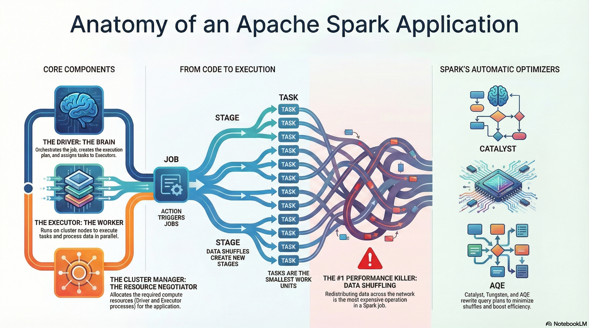
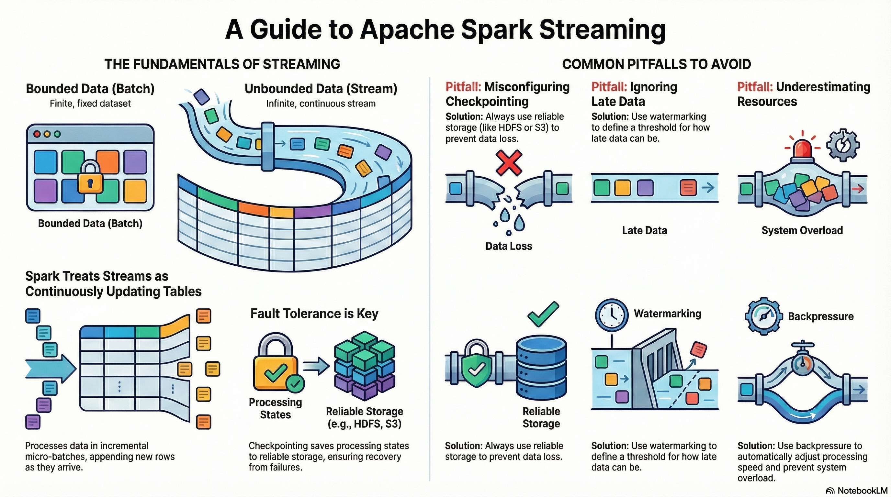

---
tags:
  - bigdata
  - workshop
  - spark
---
### ⚙️ Anatomy of Spark



### ⚙️ Spark in Streaming Mode vs. Batch Mode

Under the hood, **Spark Structured Streaming** treats the stream as an **unbounded table** — each new event represents an incremental update.

```bash
pip install pyspark
```

### 🗂️ Batch Processing

- **Definition:** Processing large volumes of data in discrete chunks (batches).
    
- **Characteristics:**
    
    - Works well for historical data and offline analytics.
        
    - High latency: results are available only after the batch is processed.
        
    - Examples: daily sales report, processing log files at the end of the day.
        
- **Advantages:**
    
    - Easier to implement and debug.
        
    - Optimized for large-scale computations.
        
- **Disadvantages:**
    
    - Cannot respond to events in real-time.
        
    - Not suitable for live monitoring or alerts.

💡 _Example:_

```python
from pyspark.sql import SparkSession
from pyspark.sql.functions import avg

spark = SparkSession.builder.appName("BatchExample").getOrCreate()

df = spark.read.csv("sensor_data.csv", header=True, inferSchema=True)
avg_temp = (
    df.groupBy("sensor_id").agg(avg("temperature").alias("avg_temperature"))
)
avg_temp.show()
```

**Explanation:** Reads a static CSV file (batch), calculates the average temperature per sensor.

### ⚡ Streaming Processing

- **Definition:** Continuous processing of incoming data in near real-time.
    
- **Characteristics:**
    
    - Low latency: data is processed as it arrives.
        
    - Continuous computations: allows aggregation, filtering, and analysis in real-time.
        
    - Examples: monitoring IoT sensors, fraud detection, real-time log analytics.
        
- **Advantages:**
    
    - Immediate insights and faster reactions.
        
    - Can handle very high volume streams with micro-batching or continuous processing.
        
- **Disadvantages:**
    
    - More complex to implement and maintain.
        
    - Requires careful handling of state and fault tolerance.

💡 _Example:_

```python
from pyspark.sql import SparkSession
from pyspark.sql.functions import col, window, avg
from pyspark.sql.types import StructType, StringType, FloatType, TimestampType


spark = SparkSession.builder.appName("StreamingExample").getOrCreate()

schema = (
    StructType()
        .add("sensor_id", StringType())
        .add("timestamp", TimestampType())
        .add("temperature", FloatType())    
)

df = spark.readStream.schema(schema).json("sensor_data_stream")
avg_temp = df.groupBy(
    window(col("timestamp"), "1 minute"),
    col("sensor_id")
).agg(avg("temperature").alias("avg_temperature"))

query = avg_temp.writeStream.outputMode("update").format("console").start()

query.awaitTermination()
```

**Explanation:** Reads JSON files continuously as they arrive in a folder, computes a 1-minute average temperature per sensor in real-time.

**Comparison Table:**

|Feature|Batch Processing|Streaming Processing|
|---|---|---|
|Latency|High|Low|
|Data Input|Historical / Static|Continuous / Real-time|
|Scalability|High|High|
|Complexity|Low|High|
|Use Case Examples|Daily reports, ETL jobs|Sensor monitoring, alerts|

💡 _Example:_

```python
from pyspark.sql import SparkSession
from pyspark.sql.functions import from_json, col, window
from pyspark.sql.types import StructType, StringType


spark = (
    SparkSession.builder
        .appName("UserActivityStream")
        .master("local[*]")
        .config("spark.jars.packages", "org.apache.spark:spark-sql-kafka-0-10_2.13:4.0.1")
        .config("spark.driver.bindAddress", "127.0.0.1")
        .config("spark.driver.host", "127.0.0.1")
        .getOrCreate()
)

schema = (
    StructType()
        .add("user_id", StringType())
        .add("action", StringType())
)

df = (
    spark.readStream.format("kafka")
        .option("kafka.bootstrap.servers", "localhost:9092")
        .option("startingOffsets", "earliest")
        .option("subscribe", "user_activity")
        .load()    
)

json_df = df.select(
    from_json(
        col("value").cast("string"), schema
    ).alias("data"),
    col("timestamp").alias("kafka_ts")
).select("data.*", "kafka_ts")


agg_df = (json_df
    .filter(col("action") == "click")
    .groupBy(window(col("kafka_ts"), "1 minute"), col("action"))
    .count()
)

query = (
    agg_df.writeStream
        .outputMode("update")
        .format("console")
        .start()
)

query.awaitTermination()
```

**This code:**

- Reads Kafka messages in real-time.
    
- Parses and filters events.
    
- Aggregates event counts by type every minute.
    
- Streams results directly to the console or a dashboard sink.

💡 _Note:_

In the following code
```python
spark = (
    SparkSession.builder
        .appName("UserActivityStream")
        .master("local[*]")
        .config("spark.jars.packages", "org.apache.spark:spark-sql-kafka-0-10_2.13:4.0.1")
        .config("spark.driver.bindAddress", "127.0.0.1")
        .config("spark.driver.host", "127.0.0.1")
        .getOrCreate()
)
```
        
- **`.master("local[*]")`**
    
    - Specifies **where Spark will run**.
        
    - `"local[*]"` means run on your **local machine using all available CPU cores**.
        
    - You could also do `local[2]` for 2 threads or `spark://host:port` to connect to a cluster.
        
- **`.config("spark.jars.packages", "org.apache.spark:spark-sql-kafka-0-10_2.13:4.0.1")`**
    
    - Adds external dependencies (JAR files) from Maven.
        
    - Here, it’s the Spark SQL Kafka connector (version 4.0.1 for Scala 2.13).
        
    - Required if you want Spark to read from or write to Kafka topics.
        
- **`.config("spark.driver.bindAddress", "127.0.0.1")`**
    
    - Sets the address that the **driver** will bind to.
        
    - Useful on local machines or in setups like Docker/WSL2 to avoid network interface issues.
        
- **`.config("spark.driver.host", "127.0.0.1")`**
    
    - Specifies the **host address that executors should use to connect to the driver**.
        
    - Important for local or networked setups to ensure executors can communicate correctly with the driver.

### 🔄 Operations on Data Streams

#### Basic Transformations

- `map()` – applies a function to each element.
    
- `filter()` – filters elements by a condition.
    
- `flatMap()` – transforms each element into **zero or more output elements**, and then flattens the result into a single sequence.

💡 _Example:_

```python
from pyspark import SparkContext

sc = SparkContext.getOrCreate()

rdd = sc.parallelize(["hello world", "how are you"])

flat_rdd = rdd.flatMap(lambda s: s.split(" "))
print(flat_rdd.collect())
```

#### Aggregations

- `reduceByKey()` – aggregates values by key in a distributed way.
    
- `groupByKey()` – groups elements by key for further processing (less efficient).
    
- `count()`, `sum()`, `avg()` – common aggregate functions.

💡 _Example:_

```python
from pyspark.sql.functions import expr

hot_sensors = (
    df.filter(col("temperature") > 30)
        .withColumn("temperature_f", col("temperature") * 9/5 + 32)
)

hot_sensors.writeStream.outputMode("append").format("console").start()
```
#### Window Operations

- Allow you to perform computations over a specific time frame.
    
- **Examples:**
    
    - `window("1 minute")` – compute aggregates every minute.
        
    - Sliding windows: `window("1 minute", "30 seconds")` – window slides every 30 seconds.
        
- **Use Cases:**
    
    - Compute average sensor readings per minute.
        
    - Detect spikes or anomalies in logs.

💡 _Example:_

```python
windowed_avg = df.groupBy(
    window(
        col("timestamp"), "1 minute", "30 seconds"
    ),
    col("sensor_id")
).avg("temperature")

windowed_avg.writeStream.outputMode("update").format("console").start()
```

**Explanation:** Sliding windows update every 30 seconds, giving smoother, overlapping results.

💡 _Stateful Aggregation Example:_

```python
from pyspark.sql.functions import max as spark_max

stateful_max = df.groupBy("sensor_id").agg(
    spark_max("temperature").alias("max_temperature")
)

stateful_max.writeStream.outputMode("complete").format("console").start()
```

**Explanation:** Maintains state for each sensor, showing maximum temperature observed so far.

### 📤 Output Modes

- `append`: only new rows are written to the sink.
    
- `complete`: entire result table is written every time.
    
- `update`: only updated rows are written.

### 🔌 Sources and Sinks

- **Sources:** Kafka, Kinesis, files, etc.
    
- **Sinks:** HDFS, Delta Lake, JDBC, console, dashboards, etc.
    
- **Fault Tolerance:** Spark Streaming supports checkpointing to maintain state across failures.

💡 _Example:_

```python
from pyspark.sql import SparkSession
from pyspark.sql.functions import from_json, col, window, expr
from pyspark.sql.types import StructType, StringType, BooleanType

schema = (
    StructType()
        .add("user_id", StringType())
        .add("action", StringType())
        .add("is_premium", BooleanType())        
)

spark = (
    SparkSession.builder
        .appName("ActivityStreaming")
        .config("spark.jars.packages", "org.apache.spark:spark-sql-kafka-0-10_2.13:4.0.1")
        .config("spark.driver.host", "127.0.0.1")
        .getOrCreate()
)

raw = (
    spark.readStream
        .format("kafka")
        .option("kafka.bootstrap.servers", "localhost:9092")
        .option("subscribe", "user_activity")
        .option("startingOffsets", "earliest")
        .load()
)

result_df = (
    raw.selectExpr("CAST(value AS STRING) AS json_string")
        .select(
            from_json(col("json_string"), schema).alias("data")
        )
        .select("data.*")
)

query = (
    result_df.writeStream
        .format("console")
        .outputMode("append")
        .option("path", "data/user_activity/")
        .option("checkpointLocation", "data/user_activity_checkpoint/")
        .trigger(continuous="1 seconds")
        .start()
)

query.awaitTermination()
```

### ⏳ Handling late data

**Late data** refers to events that arrive **later than expected** based on their **event timestamp**.
In streaming systems, this is common, especially with IoT sensors, network delays, logs, or Kafka streams.

**Examples:**

- A sensor reading arrives 3 minutes late.
- A server log event has a wrong timestamp and arrives after newer records.

**Problem:**  

If late events are ignored, aggregates (like a 1-minute average) may be incomplete. But storing all data indefinitely can cause **state to grow unbounded → memory leaks**.

#### Watermarking

- **Watermarking** in Spark Streaming is a mechanism for **dropping old events** that arrive **too late**.

- Spark uses the **event time** (timestamp in the event) and a **watermark duration**.

- All events older than `max_event_time - watermark` are **ignored in aggregations**.

**Usage:**

```python
df.withWatermark("timestamp_column", "duration")
```

- `"timestamp_column"` – column containing event timestamps.
    
- `"duration"` – allowed lateness for late data, e.g., `"2 minutes"`.
    
Spark keeps state only for the last `window + watermark` duration. Events older than `current_max_event_time - watermark` are **dropped**. This allows:

- Correct handling of late data **within the allowed delay**.

- Controlling memory usage by limiting state growth.

💡 _Example:_

```python
from pyspark.sql.functions import window, col

alerts = (
    df.withWatermark("timestamp", "2 minutes")
        .groupBy(
            window(col("timestamp"), "1 minute"),
            col("sensor_id")
        ).avg("temperature")
)
```

**Explanation:**

- Spark only considers events that arrive **no later than 2 minutes after the window ends**.
    
- Events later than 2 minutes are **ignored**.

#### Combination with windowed operations

- Watermarking is used **only with aggregations** (groupBy, count, avg, etc.).

- When combined with `window()`, it allows correct aggregation **even with out-of-order events**.

💡 _Example:_

```python
alerts_sliding = (
    df.withWatermark("timestamp", "2 minutes")
        .groupBy(
            window(col("timestamp"), "1 minute", "30 seconds"),
            col("sensor_id")
        ).avg("temperature")
)
```

**Explanation:**

- Windows slide every 30 seconds.
    
- Watermark ensures events **older than 2 minutes** do not corrupt the results.
    
💡 **_Important_**

- **Choosing watermark duration is critical:**
    
    - Too small → valid events may be dropped.
        
    - Too large → memory/state grows more.
        
- **Works only with event time**, not processing time.
    
- Can be combined with **stateful operations** for advanced use cases (e.g., tracking maximum values or trends over N minutes).

### 💻 Hands-on Exercise

**Goal:** Monitor temperature readings from IoT sensors and trigger alerts for high temperature values.

**Data Format:** JSON.

💡 _Example:_

```json
{"sensor_id": 42, "timestamp": "2025-10-11T20:00:00", "temperature": 23.5}
```

#### Exercise Steps:

1. **Read streaming data** from Kafka.
    
2. **Filter** records where `temperature > 30`.
    
3. **Aggregate** average temperature per sensor using 1-minute windows.
    
4. **Output** results to console, Delta Lake, or a dashboard.
    
#### Advanced Ideas for Workshop

- Add **sliding windows** for smoother real-time aggregation.
    
- Add **stateful operations** to track maximum temperature per sensor over a period.
    
- Connect the stream to **Kafka or WebSocket** to visualize data on a real-time dashboard.
    
- Include **late data handling** with watermarking (`withWatermark()`).

### Summary


