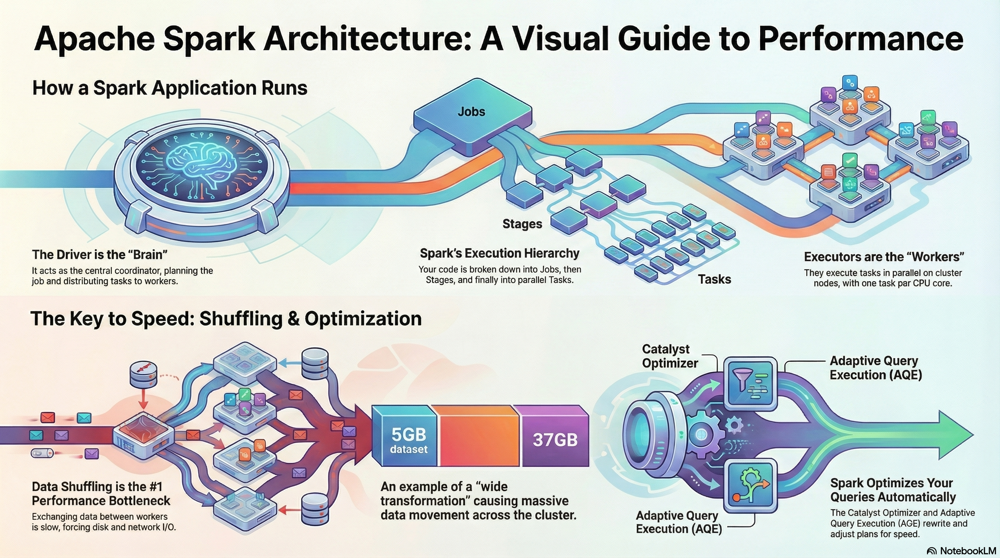
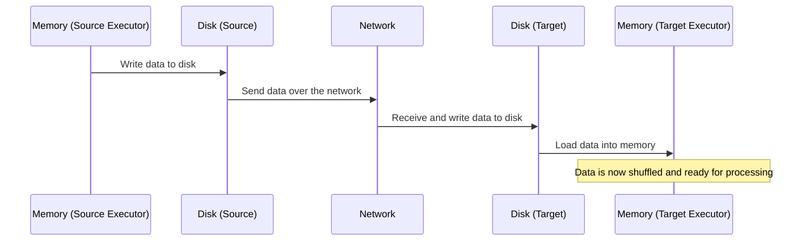
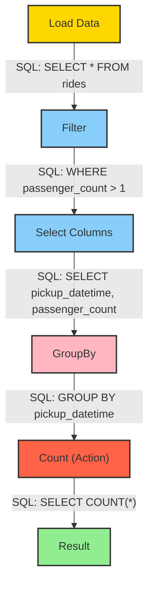
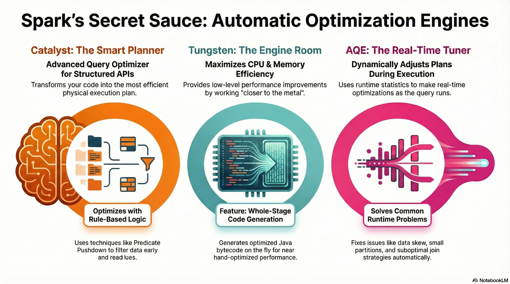

---
tags:
  - bigdata
  - workshop
  - spark
---
### ⚙️ Anatomy of Apache Spark Application


#### Key componenta of spark application

Every Apache Spark application is powered by three essential components that work together: the **Driver**, the **Executors**, and the **Cluster Manager**. To fully understand how Spark operates, it’s crucial to recognize the role of each of these elements:

- The **Driver** is the *"brain"* of the entire operation.
- The **Executors** are the *"workers"* carrying out the tasks.
- The **Cluster Manager** is the *"resource negotiator"* that brings the whole team together.

#### Driver

The Driver is the central control and coordination point for the entire Spark application. As the brain of the operation, it receives the user’s application code through an entry point called the **Spark Session** and then plans and supervises all activities from start to finish. The Driver’s main responsibilities include:

- **Execution plan analysis:** It takes the user’s code and generates an optimal execution plan for the computations.
- **Work distribution:** It divides the overall plan into smaller units called *tasks*, assigning them to available worker processes (Executors).
- **Ensuring fault tolerance:** If a task fails, the Driver is responsible for reassigning the work to another Executor, ensuring the application continues to run.

A key point to emphasize: the Driver’s role is to **organize** the work, not to process the data. The Driver almost never touches the data, because doing so would quickly make it a bottleneck.  

#### Executors

Executors are worker processes launched on the cluster’s worker nodes. They carry out the actual data processing tasks assigned by the Driver. Typically, each worker node runs one Executor. They form the computational backbone of every Spark application. Key characteristics of Executors:

- **Task execution:** Their primary responsibility is to execute the tasks they receive from the Driver.
- **Parallel processing power:** An Executor’s ability to work in parallel is determined by the number of CPU cores it has. Each core acts as a **slot** that can run one task at a time. For example, an Executor with four cores can process four tasks **simultaneously**.
- **Data exchange:** When required by the computation, Executors can exchange data with one another. This process is known as **data shuffling**.

#### Cluster Manager

Cluster Manager is the resource negotiator. It plays a single but extremely important role: its only task is to acquire and provide the computational resources (the Driver and Executor processes) needed to run the application on the cluster. The most popular cluster managers are:

- Apache YARN  
- Mesos  
- Kubernetes  
- Spark’s built-in Standalone cluster manager  

#### Putting all together

Understanding how these three components interact is key to visualizing the architecture of a Spark job. The table below provides a concise summary of their roles.

| Component        | Analogy               | Main Role                                                                 |
|------------------|------------------------|---------------------------------------------------------------------------|
| **Driver**       | Brain of the operation | Coordinates the entire application, creates the execution plan, distributes tasks. |
| **Executor**     | Worker                 | Executes data processing tasks assigned by the Driver.                    |
| **Cluster Manager** | Resource negotiator | Acquires and allocates computational resources (processes) for the Driver and Executors. |

The strength of Spark’s architecture lies in this clear separation of responsibilities:  

- **Coordination** (Driver)
- **Execution** (Executors)
- **Resource management** (Cluster Manager)

This structure enables efficient and scalable processing of massive datasets in distributed environments.

### ⚙️ Spark in Streaming Mode vs. Batch Mode

Under the hood, **Spark Structured Streaming** treats the stream as an **unbounded table** — each new event represents an incremental update.

```bash
pip install pyspark
```

### 🗂️ Batch Processing

- **Definition:** Processing large volumes of data in discrete chunks (batches).
    
- **Characteristics:**
    
    - Works well for historical data and offline analytics.
        
    - High latency: results are available only after the batch is processed.
        
    - Examples: daily sales report, processing log files at the end of the day.
        
- **Advantages:**
    
    - Easier to implement and debug.
        
    - Optimized for large-scale computations.
        
- **Disadvantages:**
    
    - Cannot respond to events in real-time.
        
    - Not suitable for live monitoring or alerts.

💡 _Example:_

```python
from pyspark.sql import SparkSession
from pyspark.sql.functions import avg

spark = SparkSession.builder.appName("BatchExample").getOrCreate()

df = spark.read.csv("sensor_data.csv", header=True, inferSchema=True)
avg_temp = (
    df.groupBy("sensor_id").agg(avg("temperature").alias("avg_temperature"))
)
avg_temp.show()
```

**Explanation:** Reads a static CSV file (batch), calculates the average temperature per sensor.

### ⚡ Streaming Processing


- **Definition:** Continuous processing of incoming data in near real-time.
    
- **Characteristics:**
    
    - Low latency: data is processed as it arrives.
        
    - Continuous computations: allows aggregation, filtering, and analysis in real-time.
        
    - Examples: monitoring IoT sensors, fraud detection, real-time log analytics.
        
- **Advantages:**
    
    - Immediate insights and faster reactions.
        
    - Can handle very high volume streams with micro-batching or continuous processing.
        
- **Disadvantages:**
    
    - More complex to implement and maintain.
        
    - Requires careful handling of state and fault tolerance.

💡 _Example:_

```python
from pyspark.sql import SparkSession
from pyspark.sql.functions import col, window, avg
from pyspark.sql.types import StructType, StringType, FloatType, TimestampType


spark = SparkSession.builder.appName("StreamingExample").getOrCreate()

schema = (
    StructType()
        .add("sensor_id", StringType())
        .add("timestamp", TimestampType())
        .add("temperature", FloatType())    
)

df = spark.readStream.schema(schema).json("sensor_data_stream")
avg_temp = df.groupBy(
    window(col("timestamp"), "1 minute"),
    col("sensor_id")
).agg(avg("temperature").alias("avg_temperature"))

query = avg_temp.writeStream.outputMode("update").format("console").start()

query.awaitTermination()
```

**Explanation:** Reads JSON files continuously as they arrive in a folder, computes a 1-minute average temperature per sensor in real-time.

**Comparison Table:**

|Feature|Batch Processing|Streaming Processing|
|---|---|---|
|Latency|High|Low|
|Data Input|Historical / Static|Continuous / Real-time|
|Scalability|High|High|
|Complexity|Low|High|
|Use Case Examples|Daily reports, ETL jobs|Sensor monitoring, alerts|

💡 _Example:_

```python
from pyspark.sql import SparkSession
from pyspark.sql.functions import from_json, col, window
from pyspark.sql.types import StructType, StringType


spark = (
    SparkSession.builder
        .appName("UserActivityStream")
        .master("local[*]")
        .config("spark.jars.packages", "org.apache.spark:spark-sql-kafka-0-10_2.13:4.0.1")
        .config("spark.driver.bindAddress", "127.0.0.1")
        .config("spark.driver.host", "127.0.0.1")
        .getOrCreate()
)

schema = (
    StructType()
        .add("user_id", StringType())
        .add("action", StringType())
)

df = (
    spark.readStream.format("kafka")
        .option("kafka.bootstrap.servers", "localhost:9092")
        .option("startingOffsets", "earliest")
        .option("subscribe", "user_activity")
        .load()    
)

json_df = df.select(
    from_json(
        col("value").cast("string"), schema
    ).alias("data"),
    col("timestamp").alias("kafka_ts")
).select("data.*", "kafka_ts")


agg_df = (json_df
    .filter(col("action") == "click")
    .groupBy(window(col("kafka_ts"), "1 minute"), col("action"))
    .count()
)

query = (
    agg_df.writeStream
        .outputMode("update")
        .format("console")
        .start()
)

query.awaitTermination()
```

**This code:**

- Reads Kafka messages in real-time.
    
- Parses and filters events.
    
- Aggregates event counts by type every minute.
    
- Streams results directly to the console or a dashboard sink.

💡 _Note:_

In the following code
```python
spark = (
    SparkSession.builder
        .appName("UserActivityStream")
        .master("local[*]")
        .config("spark.jars.packages", "org.apache.spark:spark-sql-kafka-0-10_2.13:4.0.1")
        .config("spark.driver.bindAddress", "127.0.0.1")
        .config("spark.driver.host", "127.0.0.1")
        .getOrCreate()
)
```
        
- **`.master("local[*]")`**
    
    - Specifies **where Spark will run**.
        
    - `"local[*]"` means run on your **local machine using all available CPU cores**.
        
    - You could also do `local[2]` for 2 threads or `spark://host:port` to connect to a cluster.
        
- **`.config("spark.jars.packages", "org.apache.spark:spark-sql-kafka-0-10_2.13:4.0.1")`**
    
    - Adds external dependencies (JAR files) from Maven.
        
    - Here, it’s the Spark SQL Kafka connector (version 4.0.1 for Scala 2.13).
        
    - Required if you want Spark to read from or write to Kafka topics.
        
- **`.config("spark.driver.bindAddress", "127.0.0.1")`**
    
    - Sets the address that the **driver** will bind to.
        
    - Useful on local machines or in setups like Docker/WSL2 to avoid network interface issues.
        
- **`.config("spark.driver.host", "127.0.0.1")`**
    
    - Specifies the **host address that executors should use to connect to the driver**.
        
    - Important for local or networked setups to ensure executors can communicate correctly with the driver.

### 🔄 Operations on Data Streams

#### Basic Transformations

- `map()` – applies a function to each element.
    
- `filter()` – filters elements by a condition.
    
- `flatMap()` – transforms each element into **zero or more output elements**, and then flattens the result into a single sequence.

💡 _Example:_

```python
from pyspark import SparkContext

sc = SparkContext.getOrCreate()

rdd = sc.parallelize(["hello world", "how are you"])

flat_rdd = rdd.flatMap(lambda s: s.split(" "))
print(flat_rdd.collect())
```

#### Aggregations

- `reduceByKey()` – aggregates values by key in a distributed way.
    
- `groupByKey()` – groups elements by key for further processing (less efficient).
    
- `count()`, `sum()`, `avg()` – common aggregate functions.

💡 _Example:_

```python
from pyspark.sql.functions import expr

hot_sensors = (
    df.filter(col("temperature") > 30)
        .withColumn("temperature_f", col("temperature") * 9/5 + 32)
)

hot_sensors.writeStream.outputMode("append").format("console").start()
```
#### Window Operations

- Allow you to perform computations over a specific time frame.
    
- **Examples:**
    
    - `window("1 minute")` – compute aggregates every minute.
        
    - Sliding windows: `window("1 minute", "30 seconds")` – window slides every 30 seconds.
        
- **Use Cases:**
    
    - Compute average sensor readings per minute.
        
    - Detect spikes or anomalies in logs.

💡 _Example:_

```python
windowed_avg = df.groupBy(
    window(
        col("timestamp"), "1 minute", "30 seconds"
    ),
    col("sensor_id")
).avg("temperature")

windowed_avg.writeStream.outputMode("update").format("console").start()
```

**Explanation:** Sliding windows update every 30 seconds, giving smoother, overlapping results.

💡 _Stateful Aggregation Example:_

```python
from pyspark.sql.functions import max as spark_max

stateful_max = df.groupBy("sensor_id").agg(
    spark_max("temperature").alias("max_temperature")
)

stateful_max.writeStream.outputMode("complete").format("console").start()
```

**Explanation:** Maintains state for each sensor, showing maximum temperature observed so far.

### 📤 Output Modes

- `append`: only new rows are written to the sink.
    
- `complete`: entire result table is written every time.
    
- `update`: only updated rows are written.

### 🔌 Sources and Sinks

- **Sources:** Kafka, Kinesis, files, etc.
    
- **Sinks:** HDFS, Delta Lake, JDBC, console, dashboards, etc.
    
- **Fault Tolerance:** Spark Streaming supports checkpointing to maintain state across failures.

💡 _Example:_

```python
from pyspark.sql import SparkSession
from pyspark.sql.functions import from_json, col, window, expr
from pyspark.sql.types import StructType, StringType, BooleanType

schema = (
    StructType()
        .add("user_id", StringType())
        .add("action", StringType())
        .add("is_premium", BooleanType())        
)

spark = (
    SparkSession.builder
        .appName("ActivityStreaming")
        .config("spark.jars.packages", "org.apache.spark:spark-sql-kafka-0-10_2.13:4.0.1")
        .config("spark.driver.host", "127.0.0.1")
        .getOrCreate()
)

raw = (
    spark.readStream
        .format("kafka")
        .option("kafka.bootstrap.servers", "localhost:9092")
        .option("subscribe", "user_activity")
        .option("startingOffsets", "earliest")
        .load()
)

result_df = (
    raw.selectExpr("CAST(value AS STRING) AS json_string")
        .select(
            from_json(col("json_string"), schema).alias("data")
        )
        .select("data.*")
)

query = (
    result_df.writeStream
        .format("console")
        .outputMode("append")
        .option("path", "data/user_activity/")
        .option("checkpointLocation", "data/user_activity_checkpoint/")
        .trigger(continuous="1 seconds")
        .start()
)

query.awaitTermination()
```

### ⏳ Handling late data

**Late data** refers to events that arrive **later than expected** based on their **event timestamp**.
In streaming systems, this is common, especially with IoT sensors, network delays, logs, or Kafka streams.

**Examples:**

- A sensor reading arrives 3 minutes late.
- A server log event has a wrong timestamp and arrives after newer records.

**Problem:**  

If late events are ignored, aggregates (like a 1-minute average) may be incomplete. But storing all data indefinitely can cause **state to grow unbounded → memory leaks**.

#### Watermarking

- **Watermarking** in Spark Streaming is a mechanism for **dropping old events** that arrive **too late**.

- Spark uses the **event time** (timestamp in the event) and a **watermark duration**.

- All events older than `max_event_time - watermark` are **ignored in aggregations**.

**Usage:**

```python
df.withWatermark("timestamp_column", "duration")
```

- `"timestamp_column"` – column containing event timestamps.
    
- `"duration"` – allowed lateness for late data, e.g., `"2 minutes"`.
    
Spark keeps state only for the last `window + watermark` duration. Events older than `current_max_event_time - watermark` are **dropped**. This allows:

- Correct handling of late data **within the allowed delay**.

- Controlling memory usage by limiting state growth.

💡 _Example:_

```python
from pyspark.sql.functions import window, col

alerts = (
    df.withWatermark("timestamp", "2 minutes")
        .groupBy(
            window(col("timestamp"), "1 minute"),
            col("sensor_id")
        ).avg("temperature")
)
```

**Explanation:**

- Spark only considers events that arrive **no later than 2 minutes after the window ends**.
    
- Events later than 2 minutes are **ignored**.

#### Combination with windowed operations

- Watermarking is used **only with aggregations** (groupBy, count, avg, etc.).

- When combined with `window()`, it allows correct aggregation **even with out-of-order events**.

💡 _Example:_

```python
alerts_sliding = (
    df.withWatermark("timestamp", "2 minutes")
        .groupBy(
            window(col("timestamp"), "1 minute", "30 seconds"),
            col("sensor_id")
        ).avg("temperature")
)
```

**Explanation:**

- Windows slide every 30 seconds.
    
- Watermark ensures events **older than 2 minutes** do not corrupt the results.
    
💡 **_Important_**

- **Choosing watermark duration is critical:**
    
    - Too small → valid events may be dropped.
        
    - Too large → memory/state grows more.
        
- **Works only with event time**, not processing time.
    
- Can be combined with **stateful operations** for advanced use cases (e.g., tracking maximum values or trends over N minutes).

### 💻 Hands-on Exercise

**Goal:** Monitor temperature readings from IoT sensors and trigger alerts for high temperature values.

**Data Format:** JSON.

💡 _Example:_

```json
{"sensor_id": 42, "timestamp": "2025-10-11T20:00:00", "temperature": 23.5}
```

#### Exercise Steps:

1. **Read streaming data** from Kafka.
    
2. **Filter** records where `temperature > 30`.
    
3. **Aggregate** average temperature per sensor using 1-minute windows.
    
4. **Output** results to console, Delta Lake, or a dashboard.
    
#### Advanced Ideas for Workshop

- Add **sliding windows** for smoother real-time aggregation.
    
- Add **stateful operations** to track maximum temperature per sensor over a period.
    
- Connect the stream to **Kafka or WebSocket** to visualize data on a real-time dashboard.
    
- Include **late data handling** with watermarking (`withWatermark()`).


### ⚙️ Apache Spark Performance



#### The main performance bottleneck

Data shuffling is the process of redistributing data across partitions, which usually requires moving large amounts of data between executors over the network. This operation breaks Spark’s efficient in-memory processing model and is therefore one of the most expensive parts of a Spark job.

Shuffling hurts performance because it triggers a heavy sequence of I/O operations. In simple terms, the data must be taken out of memory, written to disk, sent over the network, written to disk again on the receiving side, and then finally loaded back into memory. Each of these steps introduces significant disk and network latency, turning shuffling into a major performance bottleneck.



#### Impact of Data Cardinality

The performance impact of a shuffle is strongly influenced by the cardinality—the number of unique values—in the column used in a wide transformation.

- **Low Cardinality:** Grouping by a column with only a few distinct values, such as **payment_type**, results in minimal data exchange.

- **High Cardinality:** Grouping by a column with many unique values, such as **datetime**, is significantly more expensive.

- **Sorting (performance hell):** An **orderBy** operation represents the worst-case scenario. To establish a global ordering, every worker must send its data to other workers so that all partitions can be fully sorted relative to each other. This forces an all-to-all data exchange, which is extremely expensive. Whenever possible, this operation _should be avoided in data engineering workflows_.

#### Lazy Evaluation

Lazy evaluation is the fundamental principle that enables Spark’s advanced optimizers to work effectively. Instead of executing transformations immediately, Spark records them and builds a **logical plan of computation**, known as a **DAG (Directed Acyclic Graph)**.

A **DAG** is a graph where each node represents an operation (like a transformation), and edges define the flow of data between these operations. “Acyclic” means the graph contains no loops — data always moves forward.

In Spark, the DAG describes **how** each transformation depends on previous ones. When an action is finally invoked, Spark analyzes the entire DAG, optimizes it, breaks it into **stages**, and then executes it in the most efficient way possible.



#### Transformations Actions

Operations in Spark fall into two categories: those that are **lazy** and build up the computation plan (the DAG), and those that **trigger the execution** of the entire DAG.

- **Lazy operations:** `filter`, `select`, `groupBy`, `join`
- **Actions (trigger execution):** `count`, `show`, `save`, `collect`

The main performance advantage of lazy evaluation is that it allows the **Catalyst Optimizer** to see the _entire_ logical plan before execution. With this global view, Spark can intelligently rewrite the plan. For example, if a filter appears late in the code, Catalyst can push it "as far left as possible", closer to the data source. This reduces the amount of data read in the first place, which dramatically lowers the volume of data processed in later, more expensive stages.

To reason about performance, it’s essential to distinguish between two types of transformations:

- **Narrow transformations:** Efficient operations where each input partition contributes to exactly one output partition (e.g., `filter`, `select`). They require no data exchange between executors and can be executed within a single stage.
    
- **Wide transformations:** Expensive operations where data from multiple input partitions must be combined to produce a single output partition (e.g., `groupBy`, `sort`, `join`). These operations require a **shuffle**, which forms a natural boundary between stages.

This foundational principle enables the specialized components of Spark to apply automatic optimizations effectively.

#### Spark's Automatic Optimization Engines

A major strength of Spark’s modern architecture is its set of **automatic optimization engines**. These components relieve developers from extensive manual tuning by rewriting query plans and optimizing CPU and memory usage behind the scenes.

##### Catalyst Optimizer

**Catalyst** is Spark’s advanced query optimizer for structured APIs (DataFrames, Datasets, and SQL). It transforms a user’s code into an efficient physical execution plan through a multi-stage pipeline:

1. **Unresolved Logical Plan:** Spark first generates a raw, unresolved logical plan.
    
2. **Resolution:** Using the catalog, it resolves tables and columns to produce a fully resolved logical plan.
    
3. **Rule-Based Optimizations:** Catalyst applies rules such as:
    
    - **Predicate Pushdown:** Moves filters closer to the data source.
        
    - **Projection Pushing:** Reads only the necessary columns.  
        This results in an optimized logical plan.
        
4. **Physical Planning:** Finally, Catalyst generates one or more physical plans and uses a cost model to select the most efficient one for execution.
    
##### Project Tungsten

**Project Tungsten** focuses on low-level performance improvements, maximizing **CPU and memory efficiency**. It works “closer to the metal” than Catalyst.

Its key feature is **Whole-Stage Code Generation**, which generates optimized, task-specific Java bytecode on the fly. This eliminates the overhead of generic function calls and virtual dispatch, allowing Spark to leverage CPU registers more effectively and achieve performance closer to hand-optimized code.

##### Adaptive Query Execution (aka AQE)

**Adaptive Query Execution (AQE)** is a runtime framework that **dynamically adjusts query plans** based on statistics collected during execution. Applications with AQE enabled may show more jobs in the Spark UI, as each adjustment can trigger a new job. AQE provides several runtime optimizations:

- **Dynamic Coalescing of Shuffle Partitions:** Combines many small partitions into fewer, larger ones, reducing overhead from thousands of tiny tasks.
    
- **Dynamic Join Strategy Switching:** Switches join strategies at runtime (e.g., from sort-merge join to broadcast hash join) if one side fits in memory.
    
- **Dynamic Skew Handling:** Detects skewed partitions and splits them into smaller sub-partitions to balance the workload across executors.

Together, **Catalyst**, **Tungsten**, and **AQE** form a powerful system that automatically addresses many of the performance challenges inherent in distributed data processing.



##### Spark Performance Summary

- **Lazy Evaluation & Catalyst Optimizer:** Lazy evaluation gives Spark a global view of the computation, allowing the Catalyst Optimizer to rewrite and optimize query plans efficiently.
    
- **Wide Transformations & Shuffles:** Operations like `groupBy`, `sort`, and `join` trigger expensive **data shuffles**, which define stage boundaries and can heavily impact performance.
    
- **Adaptive Query Execution (AQE):** AQE dynamically adjusts the execution plan at runtime to reduce the cost of shuffles, optimize joins, and handle data skew.

### 🔹 Summary

- **Architecture:** Driver coordinates, Executors compute, Cluster Manager allocates resources.
    
- **Processing Modes:** Batch = high-latency, historical data; Streaming = low-latency, real-time events.
    
- **Transformations & Actions:** Lazy evaluation builds a DAG; actions trigger execution. Narrow transformations are cheap, wide transformations trigger costly shuffles.
    
- **Performance Tips:** Use Spark UI, prefer DataFrames/Datasets, minimize wide transformations.
    
- **Optimization Engines:** Catalyst rewrites query plans, Tungsten optimizes CPU/memory, AQE adapts plans at runtime.
    
- **Streaming Essentials:** Windowing, stateful aggregations, watermarks, and correct handling of late data ensure accurate and efficient real-time processing.
