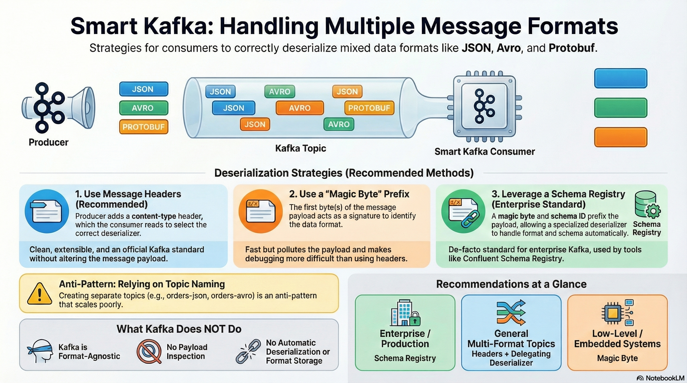

---
tags:
  - faq
---
<details>
  <summary>What is the difference between <b>SparkContext</b> and <b>SparkSession</b>?</summary>

**SparkContext** is the low-level entry point to Spark used primarily for the RDD API, while **SparkSession** is the high-level unified entry point for working with SQL, DataFrames, and Datasets, and it internally contains a SparkContext. Read [[SparkContext vs SparkSession|more]].
</details>

<details>
  <summary>Is it possible to implement a Kafka consumer so that it automatically determines the format of an incoming message and selects the appropriate deserializer?</summary>

## The best approach — **headers**

Kafka **officially supports headers**, and this is the best mechanism.

### What it looks like

The producer writes the format into a header:

```java
ProducerRecord<String, byte[]> record =
    new ProducerRecord<>("topic", key, value);

record.headers().add("content-type", "application/json".getBytes());
record.headers().add("schema", "user_v1".getBytes());
```

Consumer:

```java
Headers headers = record.headers();
String contentType = new String(headers.lastHeader("content-type").value());
```

Then:

```java
switch (contentType) {
  case "application/json" -> jsonDeserializer.deserialize(...)
  case "application/avro" -> avroDeserializer.deserialize(...)
}
```

### Pros

✔ clean

✔ extensible

✔ does not pollute the payload

✔ Kafka standard

👉 **Recommended approach**

## Magic byte / signature in the payload (as in Avro)

A classic approach — **the first byte or several bytes define the format**.

Example:

```
0x01 → JSON
0x02 → Protobuf
0x03 → Avro
```

Payload:

```
[magic_byte][actual_payload...]
```

Deserializer:

```java
byte magic = data[0];

switch (magic) {
  case 1 -> json.deserialize(...)
  case 2 -> protobuf.deserialize(...)
}
```

### Where it is used

* Confluent Avro
* Protobuf
* Thrift

### Pros / Cons

✔ fast

✔ no headers required

✖ payload is polluted

✖ worse debuggability

## Schema Registry (Avro / Protobuf / JSON Schema)

If you are using **Confluent Schema Registry**, the problem essentially disappears.

Format:

```
[magic byte][schema id][payload]
```

Deserializers:

```java
KafkaAvroDeserializer
KafkaProtobufDeserializer
KafkaJsonSchemaDeserializer
```

They **automatically understand the format** and the schema.

👉 This is the **de facto standard** in enterprise Kafka.

---

## Custom delegating deserializer (generic)

You can write **a single deserializer** that internally selects the appropriate one.

```java
public class SmartDeserializer implements Deserializer<Object> {

  private JsonDeserializer json;
  private AvroDeserializer avro;

  @Override
  public Object deserialize(String topic, Headers headers, byte[] data) {
    String type = new String(headers.lastHeader("content-type").value());

    return switch (type) {
      case "json" -> json.deserialize(topic, data);
      case "avro" -> avro.deserialize(topic, data);
      default -> throw new RuntimeException("Unknown type");
    };
  }
}
```

Kafka config:

```properties
value.deserializer=com.my.SmartDeserializer
```

✔ the consumer “understands” the format automatically

✔ the topic can be multi-format

## Via topic naming (not recommended)

```
topic-json
topic-avro
```

The consumer chooses the deserializer based on the topic name.

❌ does not scale well

❌ breaks with schema evolution

❌ anti-pattern

## ❗ What Kafka does NOT do

* Kafka **does not inspect the payload**
* Kafka **does not auto-deserialize**
* Kafka **does not store message format information**

👉 **The message format is the responsibility of the producer and the consumer**

## 💡 In short:

| Scenario             | What to use                           |
| -------------------- | ------------------------------------- |
| Enterprise / prod    | **Schema Registry**                   |
| Multiple formats     | **Headers + delegating deserializer** |
| Low-level / embedded | **Magic byte**                        |
| Streams              | **Custom Serde**                      |



</details>
